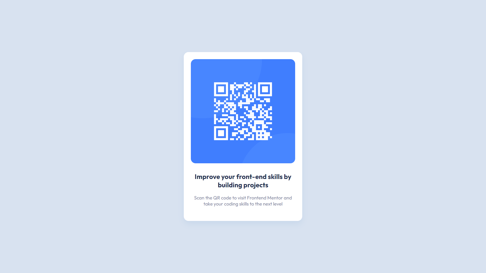

# Frontend Mentor - QR code component solution

This is a solution to the [QR code component challenge on Frontend Mentor](https://www.frontendmentor.io/challenges/qr-code-component-iux_sIO_H).

## table of contents

- [overview](#overview)
- [the process](#the-process)
  - [built with](#built-with)
  - [helpful resources](#helpful-resources)
- [author](#author)

## overview

You can see the live solution [here](https://chloelodolo.github.io/frontend-mentor-qr-code/).

## building process

This project was built with:
- semantic HTML5 markup,
- CSS custom properties,
- flexbox,
- and a mobile-first approach.

## author

- website - [chloe.lodolo.github.io](https://chloelodolo.github.io)
- frontend mentor - [@Chloé](https://www.frontendmentor.io/profile/ChloeLodolo)
